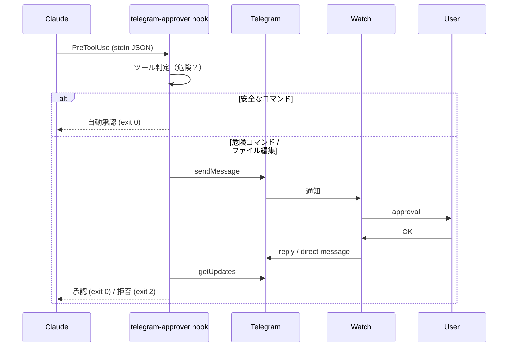

# telegram-approver

Telegram Bot API を使った承認フロー CLI ツールです。
Telegram チャットにメッセージを送信し、ユーザーからの返信（リプライまたはダイレクトメッセージ）を待って承認・拒否を判定します。

スマートウォッチ（Huawei Band など）の通知から承認できるため、
**Claude Code のコマンド実行前の承認フロー**として利用できます。

---

## 機能

- Telegram に承認メッセージ送信
- ユーザーの返信を待機（ロングポーリング、リプライ・ダイレクトメッセージ両対応）
- CLI ツールとしても Claude Code PreToolUse hook としても利用可能
- 終了コードで承認結果を返す（0=承認, 1=拒否）
- hook モード: ツール種別に応じた自動判定（危険コマンド・ファイル編集のみ承認要求）
- タイムアウト（10分）で自動拒否
- リトライ機構付き（最大5回、指数バックオフ）

---

## システム構成



---

## セットアップ

### 前提条件

- Go 1.24.4 以上
- Telegram アカウント
- Telegram Bot トークン
- チャット ID

---

### 1. Telegram Bot 作成

Telegram で **BotFather** を開きます。

https://t.me/botfather

#### Bot 作成

```
/start
/newbot
```

名前を入力

```
telegram-approver
```

username を入力（必ず `bot` で終わる）

```
telegram_approver_bot
```

作成されると **Bot Token** が表示されます。

例:

```
123456789:AAEXXXXXXXXXXXXXXXX
```

このトークンを保存してください。

---

### 2. Bot を有効化

作成した Bot を検索して `telegram_approver_bot` のチャットを開き、`/start` を送信します。

---

### 3. chat_id 取得

ターミナルで実行します。

```bash
curl https://api.telegram.org/bot<TOKEN>/getUpdates
```

レスポンス例:

```json
{
  "message": {
    "chat": {
      "id": 123456789
    }
  }
}
```

この `id` が **chat_id** です。

---

## インストール

### go install

```bash
go install github.com/motty93/telegram-approver@latest
```

### ソースからビルド

```bash
git clone https://github.com/motty93/telegram-approver.git
cd telegram-approver
go build -o telegram-approver .
```

---

## 環境変数

| 変数名 | 説明 | 必須 |
| --- | --- | --- |
| `TELEGRAM_TOKEN` | Telegram Bot API トークン | Yes |
| `TELEGRAM_CHAT_ID` | 送信先チャット ID | Yes |

設定例:

```bash
export TELEGRAM_TOKEN="your-bot-token"
export TELEGRAM_CHAT_ID="your-chat-id"
```

---

## 使い方

### デフォルトメッセージ

```bash
telegram-approver
```

送信されるメッセージ:

```
Claude approval OK / いいえ
```

### カスタムメッセージ

```bash
telegram-approver "デプロイを承認してください"
```

### hook モード（Claude Code 連携）

```bash
telegram-approver hook
```

stdin から Claude Code の PreToolUse hook JSON を読み取り、ツール種別に応じて承認判定を行います。

---

## 承認フロー

1. Telegram チャットにメッセージ送信
2. ユーザーが返信（リプライまたはダイレクトメッセージ）
3. 返信内容に応じて終了コード返却

| 返信 | 結果 | 終了コード |
| --- | --- | --- |
| `OK` | 承認 | 0 |
| `いいえ` | 拒否 | 1 |

> **注意:** Bot が送信したメッセージへの**リプライ**、または同一チャット内の**ダイレクトメッセージ**のどちらでも承認できます。
> スマートウォッチのクイックリプライ（`ReplyToMessage` が付かない場合）にも対応しています。
> `OK` は大文字・小文字を区別しません。
> 10分以内に返信がない場合はタイムアウトで拒否（exit 1）になります。

---

## スクリプトでの利用例

```bash
telegram-approver "Deploy production?"

if [ $? -ne 0 ]; then
  echo "deploy cancelled"
  exit 1
fi

echo "deploy start"
```

---

## Claude Code 連携

Claude Code の **PreToolUse hook** として `telegram-approver hook` を使用します。
ツール種別に応じて自動的に承認要否を判定し、危険な操作のみ Telegram で承認を求めます。

### hook モード

`telegram-approver hook` は stdin から Claude Code の hook JSON を読み取り、以下のように判定します：

| ツール | 判定 |
| --- | --- |
| `Bash` | 危険コマンド（`rm`, `sudo`, `deploy`, `terraform`, `docker`, `kubectl`, `gcloud`, `aws`, `git push`, `dd`, `mkfs`, `dropdb`）→ 承認要求、それ以外 → 自動承認 |
| `Edit` / `Write` | memory パス（`/.claude/projects/`）→ 自動承認、それ以外 → 承認要求 |
| その他 | 自動承認 |

### 設定例

`~/.claude/settings.json`:

```json
{
  "hooks": {
    "PreToolUse": [
      {
        "matcher": "",
        "hooks": [
          {
            "type": "command",
            "command": "telegram-approver hook"
          }
        ]
      }
    ]
  }
}
```

> **注意:** Claude Code の PreToolUse hook は、stdout に JSON を出力して `exit 0` で許可、`exit 2` でブロックと判定します。
> `telegram-approver hook` はこのプロトコルに直接対応しているため、シェルスクリプトのラッパーは不要です。

---

## スマートウォッチ承認

Telegram 通知をスマートウォッチに転送することでウォッチから承認できます。
クイックリプライ機能で `OK` を送信すれば、ウォッチだけで承認が完結します。

> **注意:** Telegram は 2021年に Wear OS / Apple Watch の公式アプリを廃止しています。
> 多くのウォッチでは OS 標準の通知リプライ機能またはサードパーティアプリに依存します。

| デバイス | 対応状況 | 備考 |
| --- | --- | --- |
| Huawei Band / Watch | 確認済み | 標準の通知リプライで動作 |
| Apple Watch | 対応 | OS 標準の通知リプライ、または [TG Watch](https://apps.apple.com/us/app/tg-watch-for-telegram/id6469582116) 等のサードパーティアプリ |
| Samsung Galaxy Watch | 条件付き対応 | OS 標準の通知リプライ、または [Telewatch](https://github.com/gohj99/Telewatch) |
| Wear OS 系 | 対応 | サードパーティアプリが豊富（[Telewatch](https://github.com/gohj99/Telewatch), [TGwear](https://github.com/TGwear/TGwear) 等） |
| Garmin | 定型文で対応（Android のみ） | 「OK」をプリセット設定すれば実用的 |
| Xiaomi / Amazfit | 条件付き対応 | Zepp Messenger または [Notify for Mi Band](https://mibandnotify.com/) 経由 |

---

## ライセンス

MIT
